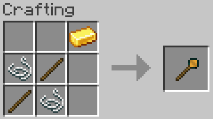
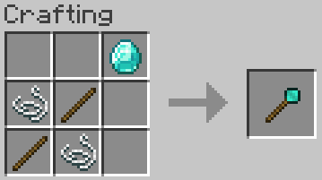

# Balanced Ore Detector (Fabric)  

Old Minecraft worlds look like swiss cheese. The underground, especially around level 10, is hollow and ugly.  
I have never liked it, and I decided to design various detectors to find ores without hollowing out the entire world.  
These ore detectors do not print out the type and coordinates of the found ores, and they do not scan the entire world.  
That would be cheating.  
But they do help finding ores a little faster than mining.

They all operate by echo location. When they are used on a solid surface, they emit three loud bangs, which get reflected from certain blocks. Each detector emits different sounds which get reflected differently. The volume of the echo, and the time till it returns, depend on the distance of the block. The pitch and the particles that may appear help to identify the block.  

The Void Detector emits a sound that is reflected from non-solid blocks, like air, water, lava and some other partly transparent blocks.

The Coal Detector emits a sound that is reflected best from coal, copper, iron and quartz ores and from a few other things that are made of these materials.

The Iron Detector does not detect coal, but, in addition to copper, iron and quartz, it detects gold, redstone and lapis.

The Gold Detector is the most universal. It detects iron, gold, redstone, lapis, diamonds and emeralds, but unfortunately it is insensitive to coal and copper.

And the Diamond Detector is the best to find the most precious ores, diamonds, emeralds and ancient debris in the nether. 

All detectors have long, but limited usability.

Every major feature of the mod is configurable in the Mod Menu.

## Requires

- [Fabric API](https://modrinth.com/mod/fabric-api)  
- [Cloth Config API](https://modrinth.com/mod/cloth-config)
- Optional, but recommended [Mod Menu](https://modrinth.com/mod/modmenu)

## Compatibility

### [Tech Reborn](https://www.curseforge.com/minecraft/mc-mods/techreborn)

Since 1.1.0  

- the Coal Detector detects galena, tin, lead, ruby and sapphire, 
- the Iron Detector detects galena, tin, lead, ruby, sapphire, silver and bauxite,
- the Gold Detector detects silver and iridium,
- and the Diamond Detector detects iridium, pyrite, cinnabar, sphalerite, tungsten, sheldonite, peridot and sodalite.

### [Applied energistics 2](https://www.curseforge.com/minecraft/mc-mods/applied-energistics-2)

Since 1.1.0

- Coal and Iron Detectors detect certus quartz too.

## License

Standard MIT license. Feel free to learn from it and incorporate it in your own projects.  

## Source code

Available on [GitLab](https://gitlab.com/pintergabor/oredetector.git) or on [GitHub](https://github.com/pinter-gabor-at/oredetector.git).  
The source code has lots of comments to help learning Minecraft modding.

## Thanks

Thanks to Kaupenjoe for his excellent [Modding By Kaupenjoe: Minecraft Modding 1.20.X for Fabric](https://www.udemy.com/course/minecraft-modding-120x-for-fabric/) course. 

## See also

My other mods on [Modrinth](https://modrinth.com/user/pinter.gabor) and on [CurseForge](https://www.curseforge.com/members/pintergabor/projects).
